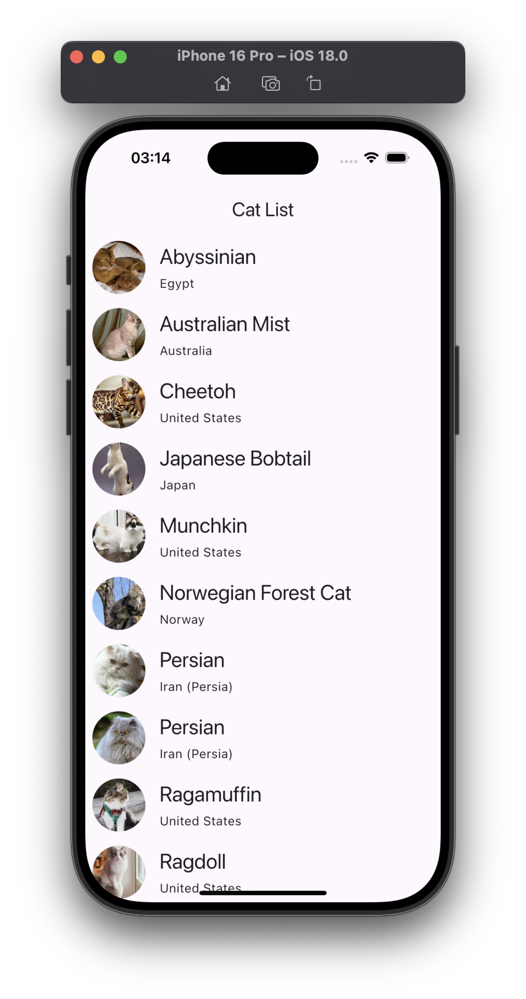
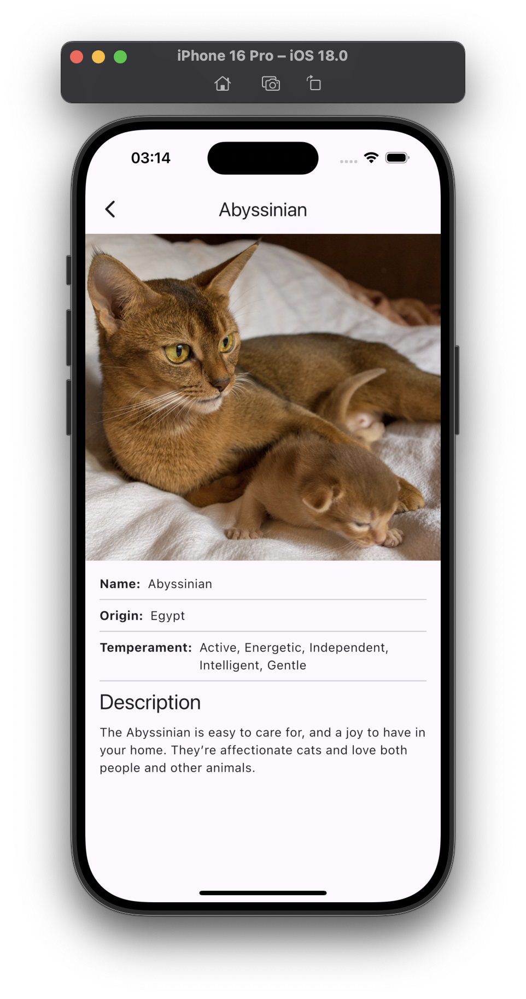

# TheCatApi-Paging.Flutter

This Flutter application demonstrates the integration of The Cat API with pagination, allowing users to browse through a list of cat images fetched from the API. It's designed with clean architecture and state management using the `Provider` package, ensuring a modular and maintainable codebase.

## Features

- **Cat Listing**: Displays a list of cats fetched from [The Cat API](https://thecatapi.com/).
- **Infinite Scrolling**: Implemented pagination to load more cats as the user scrolls.
- **Clean Architecture**: Separation of concerns through the use of repositories, use cases, and view models.
- **State Management**: Uses the `Provider` package to manage application state efficiently.
- **Error Handling**: Displays appropriate error messages when data fails to load.
- **Loading Indicator**: Shows a loading spinner when new data is being fetched from the API.

## Technologies Used

- **Flutter**: The UI framework used to build the application.
- **Dart**: The programming language used to write Flutter applications.
- **Provider**: A popular package for state management in Flutter.
- **Http**: For making HTTP requests to The Cat API.
- **Pagination**: Supports infinite scrolling to fetch more data as needed.

## Screenshots

<div style="display: flex; justify-content: space-between;">





</div>

## API Key Setup

To run this application, you will need an API key from [The Cat API](https://thecatapi.com/).

1. Get your API key from [The Cat API](https://thecatapi.com/).
2. Add the API key in the `.env.example` file:
   ```
   API_KEY=your_api_key_here
   ```
 3. Rename .env.example -> .env

## How It Works

### State Management

The app uses the `Provider` package to manage state. The `CatListViewModel` listens to data changes and updates the UI accordingly.

### Pagination

The app implements infinite scrolling to load cats in batches. As the user scrolls down, more cats are fetched from the API until no more data is available.

### Error Handling

In case of an error (e.g., network failure), the app shows an error message and gives users the option to retry loading data.

## Contributing

Contributions are welcome! If you find a bug or want to add new features, feel free to open an issue or submit a pull request.

## License

This project is licensed under the MIT License - see the [LICENSE](/LICENSE) file for details.
